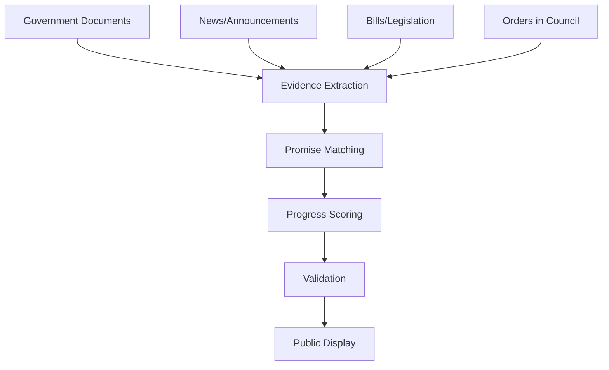

# AI Prompts & Data Processing

## Overview

The Outcome Tracker uses AI-powered analysis to process government documents, extract evidence, and score promise progress. This document explains the prompt system and how it supports transparent tracking of government commitments.

## Prompt Categories

### 1. Evidence Extraction

These prompts identify and extract relevant evidence from various government sources:

#### Bill Evidence (`prompt_bill_evidence.md`)
- Extracts evidence from parliamentary bills
- Identifies which promises are addressed
- Assesses impact and implementation timeline

#### News Evidence (`prompt_news_evidence.md`)
- Processes government news releases
- Extracts announcements and policy changes
- Links news to specific promises

#### Order in Council Evidence (`prompt_oic_evidence.md`)
- Analyzes Orders in Council (OIC)
- Identifies regulatory changes
- Maps OICs to promise implementation

#### Gazette Evidence (`prompt_gazette2_evidence.md`)
- Processes Canada Gazette publications
- Extracts regulatory implementations
- Identifies formal government actions

### 2. Promise Analysis

#### Progress Scoring (`prompt_progress_scoring.md`)
- Evaluates promise completion percentage
- Considers multiple evidence sources
- Provides consistent scoring methodology

**Scoring Scale:**
- 0-20%: Not started or minimal action
- 21-40%: Initial steps taken
- 41-60%: Substantial progress
- 61-80%: Mostly complete
- 81-100%: Fully implemented

#### Evidence-Promise Linking (`prompt_link_evidence_to_promise.md`)
- Matches evidence to specific promises
- Assesses relevance and impact
- Maintains audit trail

#### Promise Validation (`prompt_evidence_promise_validation.md`)
- Validates promise interpretations
- Ensures consistent categorization
- Checks for duplicate or overlapping promises

### 3. Content Generation

#### What It Means for Canadians (`prompt_generate_whatitmeans.md`)
- Translates policy language to plain English
- Explains practical impacts
- Provides context for citizens

### 4. Rating & Evaluation

#### Detailed Rating Instructions (`detailed_rating_instructions.md`)
- Comprehensive scoring methodology
- Evidence weighting criteria
- Quality assurance guidelines

## Build Canada Tenets

The project follows core principles outlined in `build_canada_tenets.txt`:
- Non-partisan analysis
- Evidence-based tracking
- Transparent methodology
- Citizen accessibility
- Continuous improvement

## Economic Context

The `economic_contexts/` directory contains:
- **2021 Mandate Letters**: Original government commitments
- **2025 Platform**: Updated policy positions
- **Historical Context**: Background for understanding promises

## Prompt Engineering Guidelines

### 1. Objectivity
```markdown
# Good Practice
"Identify factual actions taken by the government related to this promise"

# Avoid
"Determine if the government has successfully fulfilled this promise"
```

### 2. Evidence Requirements
All prompts require:
- Source citations
- Date of evidence
- Direct quotes when relevant
- Clear impact assessment

### 3. Consistency
Prompts use standardized:
- Scoring scales
- Impact categories
- Evidence types
- Output formats

## Data Processing Pipeline



## Adding New Prompt Types

### 1. Create Prompt File
```markdown
# prompt_new_source_evidence.md

## Objective
Extract evidence from [NEW SOURCE TYPE] that demonstrates government action on promises.

## Input Format
- Source document text
- Document metadata (date, type, url)

## Analysis Requirements
1. Identify specific government actions
2. Match to promise IDs
3. Assess implementation impact
4. Extract relevant quotes

## Output Format
```

### 2. Define Evidence Structure
```json
{
  "source_type": "new_source",
  "evidence_items": [
    {
      "promise_id": 12345,
      "action_taken": "Description of action",
      "impact": "positive|neutral|negative",
      "impact_magnitude": "minor|moderate|significant",
      "quote": "Relevant quote from source",
      "date": "2024-01-15"
    }
  ]
}
```

### 3. Integrate with Pipeline
- Add to evidence processing workflow
- Update validation rules
- Test with sample documents

## Quality Assurance

### Validation Checks
1. **Source Verification**: All evidence linked to official sources
2. **Date Consistency**: Evidence dates match source documents
3. **Promise Alignment**: Evidence correctly matched to promises
4. **Scoring Logic**: Progress scores align with evidence

### Human Review
Critical decisions require human validation:
- Major progress updates (>25% change)
- Controversial interpretations
- New evidence types
- Promise completion status

## Ethical Considerations

### Bias Prevention
- Multiple evidence sources required
- Both positive and negative evidence tracked
- Regular methodology reviews
- Community feedback integration

### Transparency
- All prompts publicly available
- Scoring methodology documented
- Evidence trails maintained
- Changes logged and justified

## Prompt Maintenance

### Regular Updates
- Review prompts quarterly
- Incorporate feedback
- Adjust for new document types
- Refine scoring accuracy

### Version Control
- Track prompt changes in git
- Document modification reasons
- Test impacts before deployment
- Maintain backwards compatibility

## Performance Metrics

Track prompt effectiveness:
- Evidence extraction accuracy
- Promise matching precision
- Scoring consistency
- Processing speed
- User trust ratings

## Future Enhancements

### Planned Improvements
1. Multi-language support
2. Provincial promise tracking
3. Real-time evidence updates
4. Advanced NLP models
5. Citizen evidence submission

### Research Areas
- Automated fact-checking
- Sentiment analysis
- Promise interdependency mapping
- Predictive completion modeling

---

For technical implementation details, see the [API Integration Guide](./API_INTEGRATION.md). 