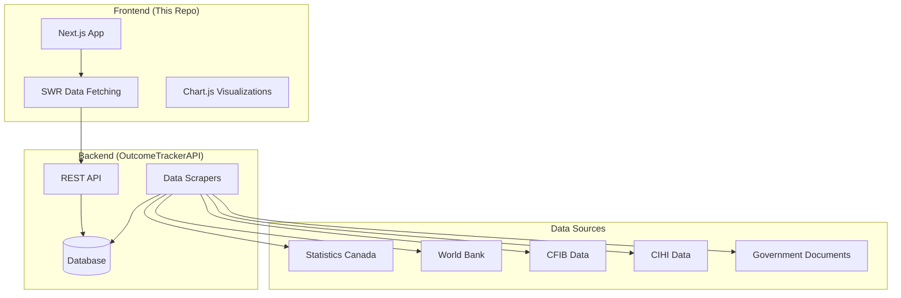

# Architecture Overview

## System Design

The Build Canada Outcome Tracker follows a modern JAMstack architecture with a clear separation between the frontend application and backend API.



## Technology Stack

### Frontend
- **Framework**: Next.js 15.2.4 with App Router
- **Language**: TypeScript 5.x
- **Styling**: 
  - Tailwind CSS for utility-first styling
  - shadcn/ui for component library
  - Custom CSS modules where needed
- **State Management**: SWR for server state
- **Charts**: Chart.js with react-chartjs-2
- **Testing**: Vitest + Storybook

### Data Fetching
- **SWR**: Used for all API calls with:
  - Automatic revalidation
  - Request deduplication
  - Optimistic updates
  - Prefetching on hover

### Build & Development
- **Package Manager**: pnpm
- **Development Server**: Next.js with Turbopack
- **Type Safety**: Strict TypeScript configuration
- **Code Quality**: ESLint + Prettier

## Project Structure

```
OutcomeTracker/
├── app/                    # Next.js App Router pages
│   ├── [department]/      # Dynamic department routes
│   ├── about/            # Static pages
│   └── layout.tsx        # Root layout
├── components/           # React components
│   ├── charts/          # Chart components
│   └── ui/              # shadcn/ui components
├── lib/                 # Utilities and types
├── metrics/             # Static metric data
├── prompts/             # AI prompt templates
├── public/              # Static assets
└── stories/             # Storybook stories
```

## Routing Architecture

The application uses Next.js App Router with the following structure:

- `/` - Redirects to `/prime-minister-office`
- `/[department]` - Dynamic route for each government department
- `/[department]/promises/[promise_id]` - Individual promise details
- `/about` - About page

### Department Routing
Departments are identified by slugs defined in `lib/types.ts`. The dynamic routing allows for:
- SEO-friendly URLs
- Easy navigation between departments
- Consistent layout across all department pages

## Data Flow

### 1. Page Load
```typescript
// Department page loads
Layout component → useSWR → API call → Department data
                          ↓
                    Prefetch on hover
                          ↓
                    Cache for instant navigation
```

### 2. Promise Details
```typescript
User clicks promise → Modal opens → Fetch promise details
                                 ↓
                           Display timeline & evidence
```

### 3. Metrics Updates
```typescript
GitHub Actions → Fetch latest data → Update JSON files
                                  ↓
                            Commit to repo
                                  ↓
                         Next.js rebuilds with new data
```

## Component Architecture

### Layout Components
- **Root Layout**: Provides global styles and providers
- **Department Layout**: Handles department-specific UI
- **Promise Layout**: Modal-based promise details

### Feature Components
- **DepartmentMetrics**: Displays key performance indicators
- **MinisterSection**: Shows minister info and promises
- **PromiseCard**: Individual promise display
- **Charts**: Various economic and performance charts

### UI Components (shadcn/ui)
- Dialog, Sheet, Card for layouts
- Button, Badge for interactions
- Skeleton for loading states
- Toast for notifications

## Performance Optimizations

### 1. Data Fetching
- **SWR Configuration**: Optimized revalidation settings
- **Prefetching**: Department data prefetched on hover
- **Static Data**: Metrics stored as JSON for fast access

### 2. Rendering
- **Server Components**: Used where possible
- **Dynamic Imports**: Charts loaded on demand
- **Image Optimization**: Next.js Image component

### 3. Navigation
- **Shallow Routing**: Department switches without full reload
- **Scroll Preservation**: Maintains position on navigation

## Security Considerations

- **API Calls**: All external API calls use environment variables
- **Input Validation**: TypeScript types ensure data integrity
- **CSP Headers**: Content Security Policy in production
- **Analytics**: Privacy-focused Simple Analytics

## Scalability

The architecture supports:
- **Horizontal Scaling**: Stateless frontend can be deployed to CDN
- **Data Growth**: Efficient pagination and filtering
- **Feature Expansion**: Modular component structure
- **Multi-language**: i18n ready with Next.js support 